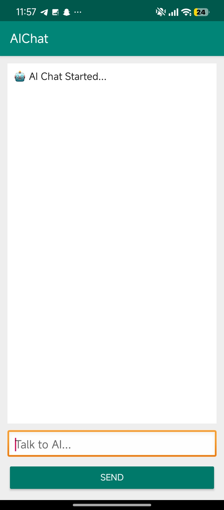
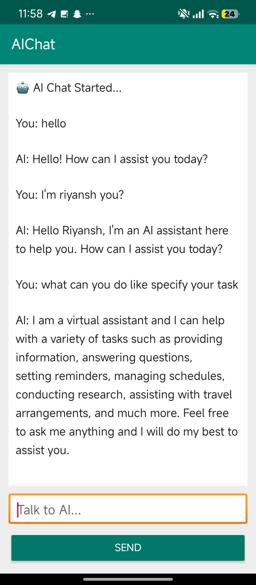
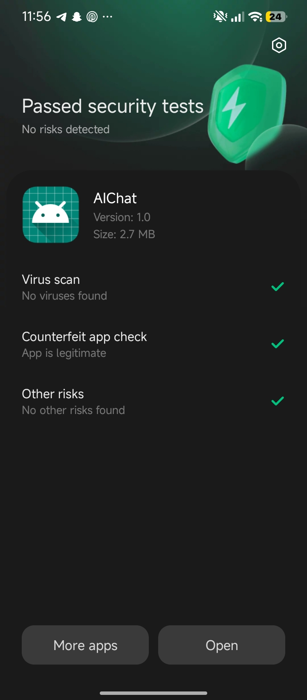
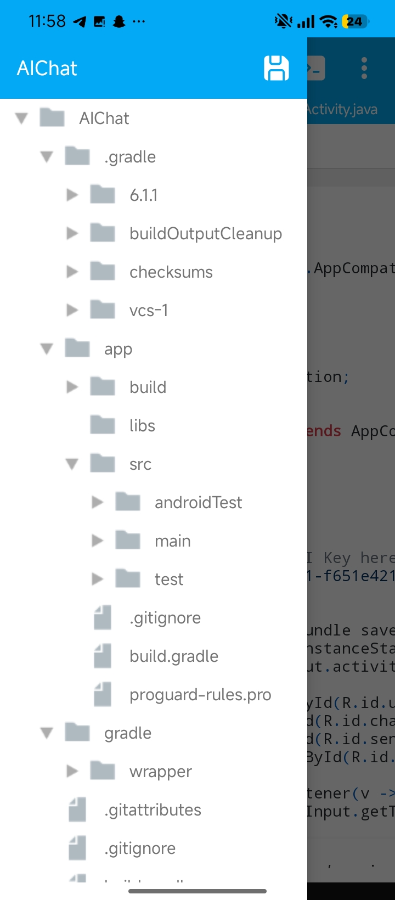

# AI Chatbot - Android Native

A lightweight, native Android application that connects to the OpenRouter API (GPT-3.5 Turbo) to provide real-time AI responses. This project demonstrates handling REST APIs, JSON parsing, and asynchronous threading in a mobile environment.

## 📱 The "Mobile-First" Story
This entire project was developed, debugged, and compiled natively on a smartphone using a mobile IDE. Managing a full Gradle project structure without a PC required manual configuration of build files and deep-diving into the Android file system. This project is a testament to the fact that high-quality software can be built regardless of hardware constraints.

## 📸 App Showcase & Development

  
  
  
  

> **Note:** The screenshots show the app's evolution from a clean UI to a functional chat interface, alongside the successful build logs and the actual mobile development environment.

## 🚀 Features
- **Asynchronous Networking:** Uses background threads (`new Thread`) to ensure the UI remains responsive during API calls.
- **Dynamic UI:** Integrated `ScrollView` with auto-scroll logic so the chat history stays in focus.
- **Modern AndroidX:** Built using AppCompat and Material Design components.
- **Custom Gradle Config:** Optimized for mobile build environments using custom Maven repositories.

## 🛠️ Tech Stack
- **Language:** Java 8
- **Backend API:** OpenRouter API (GPT-3.5 Turbo)
- **UI Layout:** XML (LinearLayout, ScrollView)
- **Build System:** Gradle 3.5.3

## 🛠️ Roadmap & Future Improvements
- [ ] **Markdown Support:** For better rendering of code snippets.
- [ ] **Voice Input:** Integrating Speech-to-Text for hands-free chatting.
- [ ] **Firebase Integration:** To save chat history across devices.

## ⚙️ Setup Instructions
1. **Clone the Repo:** Download the source files to your IDE.
2. **Add API Key:** Open `MainActivity.java` and replace the `API_KEY` placeholder with your own key from [OpenRouter](https://openrouter.ai/).
3. **Build:** Use any Android IDE (Android Studio or mobile-based) to compile the APK.

## 📥 Download
You can find the ready-to-install APK in the **[Releases](https://github.com/riiyansh_singh/AI-Chat-Android/releases)** section.

---
*Developed by Riyansh Singh — Student & Independent Developer*
